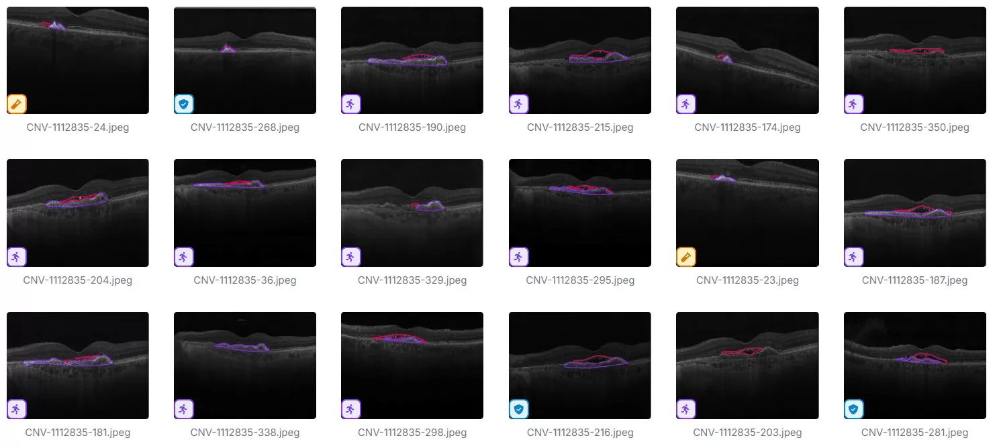
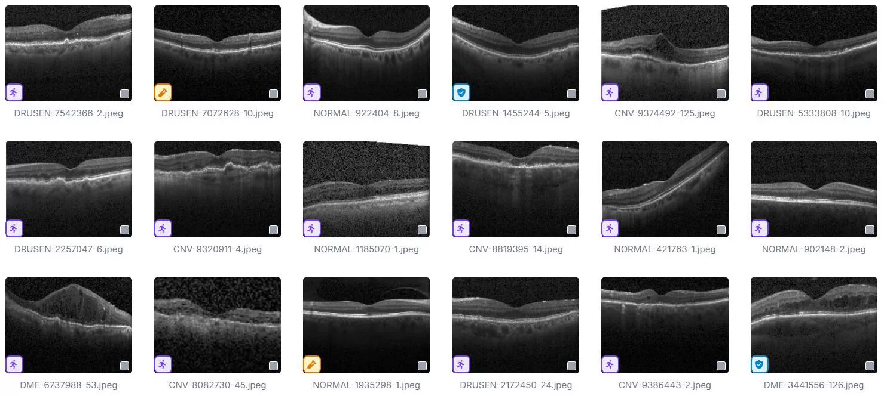
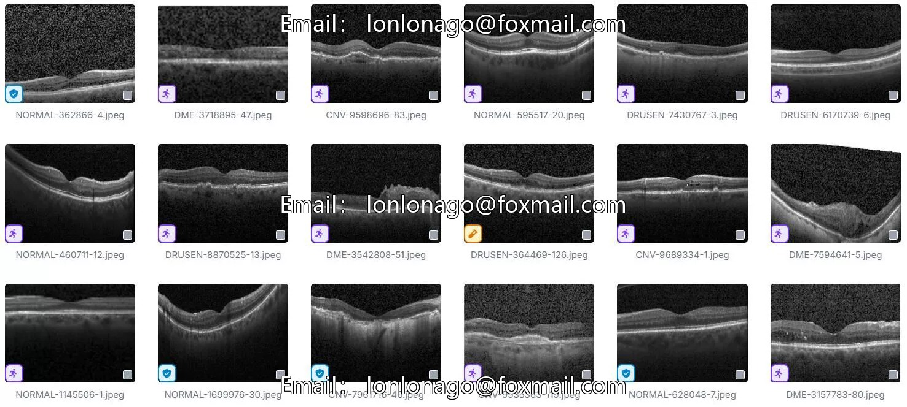

# OTC detection dataset (YOLO format)

## Body

Open Source Detection (YOLO) is a popular object detection model that uses convolutional neural networks to detect objects in images. The dataset used for training the YOLO model is called the Open Images of Daily Life (ImageNet) dataset, which contains over 10 million images of everyday objects.

The YOLO dataset is available in two formats: YOLOv2 and YOLOv3. YOLOv2 is a smaller version of the YOLOv3 dataset, which has fewer images and lower resolution. YOLOv3 is a larger version of the YOLOv2 dataset, which has more images and higher resolution.

To use the YOLO dataset for training your own object detection model, you can download it from the official website or use a library like TensorFlow Lite to load it into your program. Once you have the dataset loaded, you can train your model using the provided data and labels.

(Full product description was not available from the source page.)

## Images

## Payment

Here is a pay link on Stripe ( https://buy.stripe.com/3cs8yP7sY87d0vu9AB ). Please contact me lonlonago@foxmail.com after funding $89, and I will send you a complete data files , thank you!

